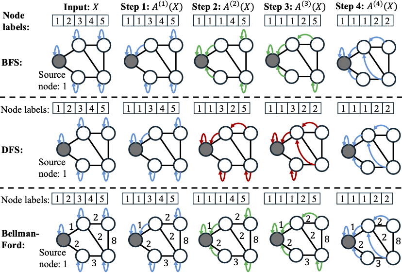
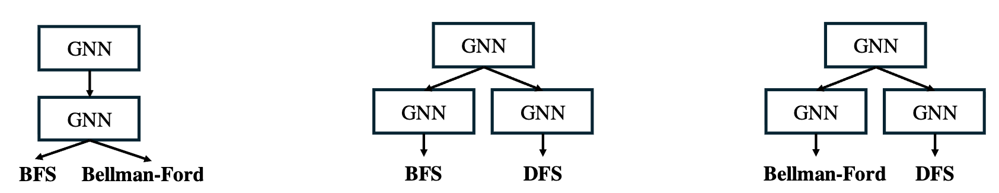
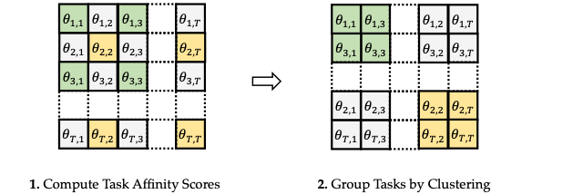
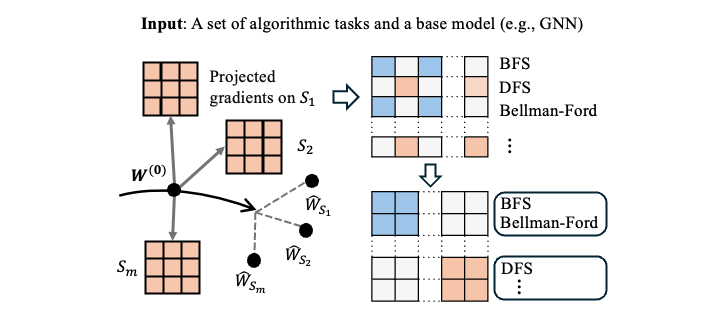
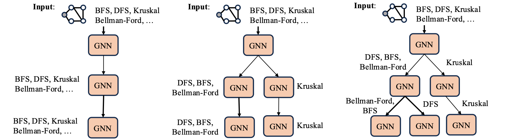
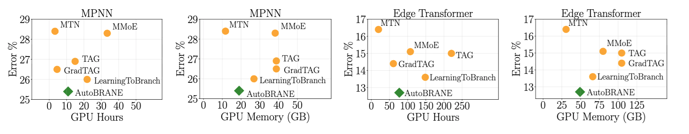
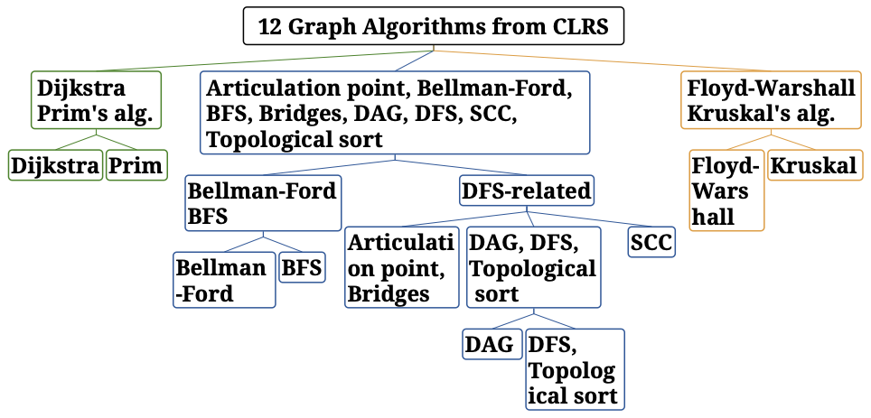
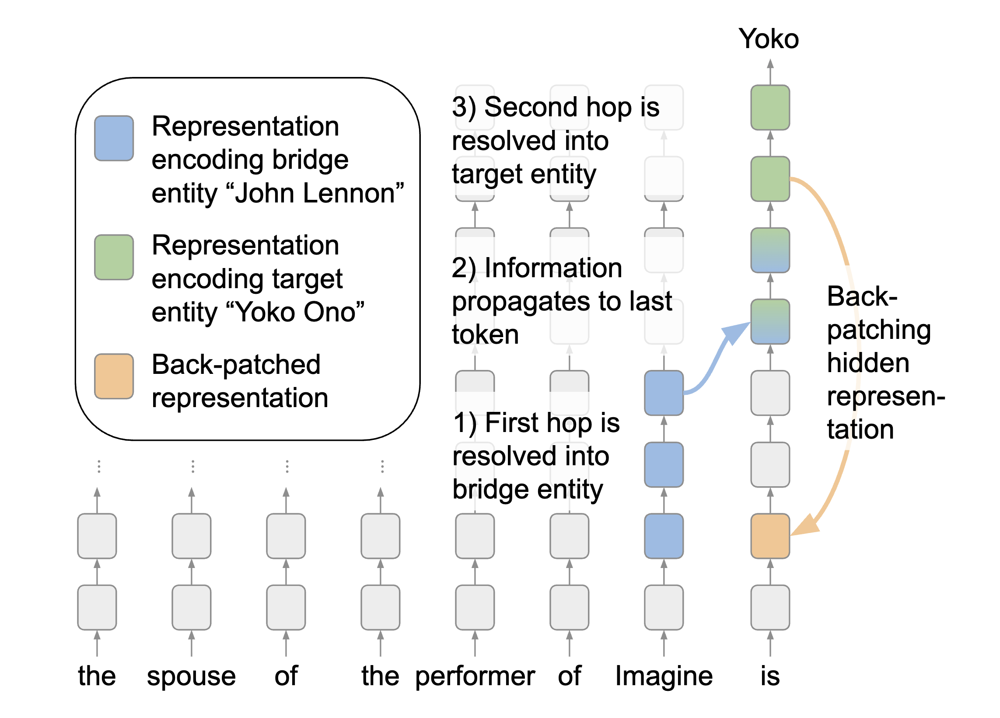

April 30, 2026

# Efficiently Learning Branching Networks for Multitask Algorithmic Reasoning

#### [Dongyue Li](https://lidongyue12138.github.io/), [Zhenshuo Zhang](https://zhenshuozhang.github.io/), [Minxuan Duan](https://www.minxuanduan.com/), [Edgar Dobriban](https://statistics.wharton.upenn.edu/profile/dobriban/), [Hongyang R. Zhang](https://www.hongyangzhang.com/)

<!-- **TL;DR** Modern AI systems are increasingly built on step-by-step reasoning abilities of the underlying models. Systems like [OpenAI’s o3](https://openai.com/index/introducing-o3-and-o4-mini/) are designed to “think longer” on hard problems instead of immediately producing an answer. Many agentic systems (cf. [NVIDIA’s overview of LLM reasoning and test-time scaling](https://developer.nvidia.com/blog/an-easy-introduction-to-llm-reasoning-ai-agents-and-test-time-scaling/?utm_source=chatgpt.com)) rely on models that plan, call tools, execute subtasks, and refine results in stages. As a result, there is a growing need for models that can handle multiple step-by-step reasoning tasks at the same time. -->

In this paper, we study algorithmic reasoning: how can we train a neural network to follow the step-by-step execution of several classical algorithms simultaneously? The difficulty is that, when one network tries to learn them all at once, the tasks interfere with each other due to the difference in their algorithmic execution process. In this post, we introduce a method that automatically learns a branching neural network that groups related tasks together while separating those that diverge. Instead of manually designing task-specific models or exhaustively searching over architectures, our approach estimates task similarity using gradient-based signals and constructs a branching structure layer by layer. The method can be applied on top of graph neural networks or large language models with LoRA adapters. 

- [Paper](https://arxiv.org/pdf/2512.01113)
- [GitHub](https://github.com/VirtuosoResearch/Algorithmic-reasoning-code)

<figure style="text-align:center;">
  
</figure>

## Algorithmic Reasoning

Algorithmic reasoning describes a neural network's reasoning ability by how well it can learn to mimic the step-by-step computations performed by classical algorithms. As a concrete example, imagine asking an AI to navigate a complex, unseen city grid to find the shortest route. A standard neural network, acting purely on pattern recognition, might just guess a path based on similar-looking maps it memorized during training. The moment it encounters a new city layout, it gets lost. A model capable of algorithmic reasoning can learn to execute a procedure like Dijkstra's algorithm. Thus, algorithmic reasoning focuses on teaching neural networks how to perform step-by-step logical inference by learning to execute classical algorithms. Instead of just memorizing the final output, the network learns the internal mechanics of the algorithm.

### How Are the Tasks Defined?

In algorithmic reasoning, tasks are defined by algorithmic trajectories. A trajectory contains the input, the final output, and a sequence of intermediate steps that capture the state of the algorithm at every computational step.

- Because algorithms generally manipulate sets of objects and relations, data is typically represented as a graph of nodes and edges.
- Predicting an intermediate algorithmic step is often formulated as a node-labeling classification task. 
- For example, when running a Breadth-First Search (BFS), the network is trained to predict the index of the predecessor node in the current traversal path at each individual step.

To help understand the definition, let's look at an example illustrated in a figure below on a toy graph with five nodes, for three algorithms (breadth-first search, depth-first search, and Bellman-Ford). To understand the encoding, each intermediate step is labeled by the predecessor of each node along the traversal path, leading to a node label vector for each step. The node labels are initially the indices of the nodes. 

- In BFS, starting from node 1, the first step visits node 2. Hence, we update node 2's label as 1, which is its predecessor. In step 2, node 3 is visited, hence its node label is 1. Step 3 visits node 4 (with predecessor 2) and Step 4 visits node 5 with predecessor 2.
- In DFS, the first step 1 visits node 2, whose predecessor becomes 1. Step 2 visits node 3, whose predecessor is 2. Step 3 visits node 4 from 3 and step 4 visits node 5 from 4.
- Notice that in step 2, BFS and Bellman-Ford follow the same traversal path, but DFS follows a different path.



To unify research in this area, the CLRS Algorithmic Reasoning Benchmark (CLRS-30) [1] was created. It provides defined trajectories for 30 classical algorithms sourced from the *Introduction to Algorithms* textbook, spanning algorithms from sorting and searching to complex dynamic programming and graph traversals. 

- In particular, each intermediate step is treated as a node labeling sub-task, and the loss objective sums over all the intermediate node labeling sub-tasks. 

- Prior work has found that message-passing neural networks can learn to accurately predict both the intermediate and final steps of a graph algorithm, where a graph is sampled from a fixed distribution.  

## Multitask Algorithmic Reasoning

If we can teach a network one algorithm, the natural next question is: can we design a model capable of solving multiple algorithmic reasoning tasks simultaneously?

This problem is inherently difficult due to the negative interference, when execution steps differ drastically between algorithms. For instance, BFS and Bellman-Ford might share the exact same intermediate node labels in their first step, but a Depth-First Search will quickly branch off into a different traversal path. If a single processor is forced to predict all three simultaneously, interference is unavoidable. Conversely, training separate networks for multiple tasks scales poorly, drastically increasing memory costs at inference time.

### Our Solution: Learning Branching Neural Networks

We now describe a new algorithm that automatically learns one neural network for multitask algorithmic reasoning.  Our approach involves learning a branching network that can be applied on top of any base model, enabling more flexible parameter sharing based on estimated task similarity scores. 

For example:

- For GNNs, one can instantiate multiple networks per layer and assign a specific GNN to each task at each layer. See the Figure below for several examples of branching GNNs.
- For LLMs, one can apply parameter-efficient fine-tuning such as low-rank adapters (LoRA), and design a branching structure of LoRAs on top of a pretrained LLM.

- We present three examples of branching GNNs, each designed to learn a pair of algorithms. As shown in the toy graph above, all three algorithms share identical node labels in the first step, so the same initial GNN layer applies to all. BFS and Bellman–Ford continue to share encodings in steps 2 and 3, thus reusing the second layer, while DFS branches out. 

<figure style="text-align:center;">
  
</figure>

The primary challenge in building such a network is determining the optimal structure. If we have $n$ tasks, $L$ layers, and each layer can be split into $k$ branches, the number of possible tree configurations is $k^{nL}$. For even a modest number of tasks and layers, this search space is large, making an exhaustive search impossible. 

To address this, we design an approach named **AutoBRANE** [2] to automatically find a branching structure from task data efficiently without the need for exhaustive training. In a high-level, the algorithm has two components. First, we design an algorithm that, given a set of algorithmic reasoning tasks, partitions them into (at most) disjoint groups via convex optimization. Second, we search for a branching network by recursively performing the partitioning from the first layer until layer $L$.

### Part I: Partitioning at One Layer

We first describe the procedure that, given a subset of tasks $S\subseteq \set{1, \dots, n}$ at one layer, determines a partition of $S$, corresponding to the branching structure at the next layer. The procedure involves two main steps as illustrated in a Figure below. 

- First, we estimate task affinity scores based on partitioning inherited from previous layers. Each task affinity score between two tasks measures the average performance of a target when another task appears in the same subset of it. To compute such task affinity scores, it is analogous to the feature importance score used in random forests, which evaluates model performances trained on randomly sampled task subsets [3]. 
- After computing the task affinity score matrix, we generate a partition of the tasks by applying a clustering algorithm. 



Computing the task affinity scores requires training networks repeatedly on many subsets. Instead, we design an algorithm that estimates affinity scores *without repeated training*. The key idea is to use *a first-order approximation of the network output around an initialization*.

- We apply a first-order approximation of the network output around a pretrained network initiation, such as one trained on all tasks.  

- Then, applying the approximation in the model loss in training the network on a subset of tasks, we can estimate the network parameters fine-tuned on a subset of tasks by *solving a logistic regression problem using the gradients as features*.

Therefore, we replace the repeated training on random subsets with solving logistic regression problems on the gradients of each subset. Crucially, the running time involves training the initialization on all tasks and evaluating the gradients on the samples of all tasks. We illustrate the procedure in a figure below. 

<figure style="text-align:center;">
  
</figure>

### Part II: Learning Branching Structures

Next, we search for a branching network via a top-down procedure. The algorithm begins with a single network with one module per layer. Starting at the first layer, tasks are grouped into $k_1$ clusters, creating $k_1$ modules. If $k_1 = 2$, tasks are split into two groups. The procedure continues recursively: Each group is further split at the next layer. If both are split into two groups, the second layer then contains four modules. This continues until the last layer. We illustrate a splitting of a branching network with GNN as the base model below. 

<figure style="text-align:center;">
  
</figure>

In summary, in terms of running time, for $n$ tasks, at each layer, the algorithm takes $O(n)$ time to find a partitioning, since the union of sets is at most $n$. In total, AutoBRANE takes $O(nL)$ time. Regarding memory usage,  suppose the last layer contains $k$ clusters, and at each layer, the number of clusters grows by a constant factor.  Then the total number of nodes in the tree is roughly $k$.

### Experimental Results

When applying our approach, AutoBRANE, to the CLRS benchmark, we find that our approach achieves the best trade-off between error rate, GPU hours, and memory usage, as compared to existing multitask and branching network baselines. We show the results of using edge transformers [2] as the base model. AutoBRANE outperforms a single multitask network by 3.7%, demonstrating the effectiveness of branching networks in leveraging positive task transfer. It also achieves the best overall trade-off, reducing the average error rate by 1.2% compared to other multitask learning baselines, while using 48% fewer GPU hours and 26% less memory.

<figure style="text-align:center;">
  
</figure>

Moreover, the resulting branching structure aligns well with task similarities in their intermediate steps, revealing three major clusters. As shown in an example below, the largest includes BFS, Bellman-Ford, and several DFS-based algorithms. Notably, BFS and Bellman-Ford are grouped together, consistent with observations from [4]. Five DFS-related tasks, including topological sort and DAG shortest paths, are clustered around DFS. Prim’s and Dijkstra’s algorithms form a group, reflecting their shared greedy edge-selection strategy. Kruskal’s and Floyd-Warshall are grouped as well, both involving edge selection within components. 



Our approach also applies to text-based graph reasoning tasks, by constructing a branching structure of LoRA adapters on a large language model. 
AutoBRANE is compared against MTN, which fine-tunes a single LoRA adapter across all tasks, and the strongest multitask baseline. On the CLRS-Text benchmark, AutoBRANE improves average test accuracy by 5.5% relative to MTN and by 3.2% over the existing multitask baseline. This highlights the advantage of the branching structure in capturing varying levels of task similarity. To demonstrate the broader applicability, we also evaluate on the [GraphQA](https://research.google/blog/talk-like-a-graph-encoding-graphs-for-large-language-models/) and [GraphWiz](https://arxiv.org/abs/2402.16029) datasets and observe quantitatively similar gains.

## Usage of AutoBRANE

If you’d like to experiment with multitask algorithmic reasoning yourself, below is a simple walkthrough of how to run our branching structure search on the CLRS datasets. We will describe [the main script](https://github.com/VirtuosoResearch/Algorithmic-reasoning-code/blob/main/clrs_experiments/branchnn_search.py) to run the search procedure for finding a branching network. 

Before starting, install dependencies by following the repo [README](https://github.com/VirtuosoResearch/Algorithmic-reasoning-code/tree/main).

### Searching for the branching structures

Use `branchnn_search.py` to conduct the search for the branching structures. 

At each layer, it:

1. Trains a model initialization (freezing earlier layers).
2. Computes gradients for each task.
3. Estimates task affinity using the gradient-based estimation.
4. Clusters tasks via convex optimization.
5. Recursively splits tasks layer by layer.

The result is a learned branching architecture. No manual design required.

```python
CUDA_VISIBLE_DEVICES=$CUDA_DEVICE python branchnn_search.py \
        --algorithms "bfs","dfs","topological_sort","articulation_points","bridges","strongly_connected_components","mst_kruskal","mst_prim","dijkstra","bellman_ford",'dag_shortest_paths',"floyd_warshall" \
        --processor_type "edge_t" --num_layers 5 --hidden_size 192 \
        --gradient_projection_dim 400 --num_subsets 200 --subset_size 3
```

**Key Arguments**: 

- `--processor_type`: Type of GNN processor, such as `branching_edge_t` for building the branching neural networks with Edge Transformers

- `--algorithms`: Specification of the set of all algorithmic tasks 
- `--num_layers`: Number of network layers 
- `--num_subsets`: Number of subsets to estimate task affinity scores
- `--subset_size`: The size of each subset to estimate task affinity scores

### Internal Procedures

The following procedures happens internally within the script: 

1. Train a meta-initialization where the model is trained with earlier layers frozen

``` Python
# Step 1: train a model with freezing l-1 layers 
cur_set = list(cur_set)
os.system("CUDA_VISIBLE_DEVICES=2 python -m clrs.examples.run \
        --algorithms {} --processor_type {} --num_layers {} --hidden_size {} \
        --load_checkpoint_path {} --freeze_processor --freeze_layers {} \
        --use_projection --projection_dim 16".format(
            ",".join(cur_set), 
            args.processor_type, 
            args.num_layers, 
            args.hidden_size,
            cur_checkpoint if cur_checkpoint is not None else "test",
            cur_layer - 1
        ))
```

2. Compute task gradients. For each algorithm, gradients are computed with respect to shared parameters.

``` Python
# Step 2: Compute the gradients of the model
tmp_checkpoint = f"processor_{args.processor_type}_layers_{args.num_layers}_dim_{args.hidden_size}_" \
                + "_".join([algorithm[:3] for algorithm in cur_set])
for i, algo in enumerate(cur_set):
    os.system("CUDA_VISIBLE_DEVICES=2 python -m clrs.examples.fast_estimation_compute_gradients \
    --algorithms {} --processor_type {} --num_layers {} --hidden_size {}\
    --use_projection --projection_dim 16 --batch_size 1 \
    --load_checkpoint_path {} --train_steps 50\
    --change_algo_index {} --gradient_projection_dim {}".format(
        algo,
        args.processor_type,
        args.num_layers,
        args.hidden_size,
        tmp_checkpoint,
        i,
        args.gradient_projection_dim
    ))
```

3. Estimate task affinities. Instead of retraining on every task subset, the code uses a first-order approximation around a shared initialization and solves a small logistic regression problem using gradients

```python
# Step 3: Estimate the performance of the model on subsets, freezing the l layers
os.system("CUDA_VISIBLE_DEVICES=2 python -m clrs.examples.fast_estimation_linear_regression\
    --algorithms {} --processor_type {} --num_layers {} --hidden_size {}\
    --use_projection --projection_dim 16 --batch_size 1 \
    --load_checkpoint_path {}\
    --layer {} --gradient_projection_dim {} --regularization_lambda 1e3 \
    --num_subsets {} --num_subset_size {}".format(
        ",".join(cur_set),
        args.processor_type,
        args.num_layers,
        args.hidden_size,
        tmp_checkpoint,
        cur_layer,
        args.gradient_projection_dim,
        args.num_subsets,
        args.subset_size
))
```

4. Cluster tasks. A regularized SDP clustering groups tasks to maximize within-cluster affinity.

````python
# Step 4: Estimate the task affinity and cluster the tasks
task_affinities = estimate_task_affinities(cur_set, args)

X_final, assignment = run_regularized_sdp_clustering(task_affinities, size_lam=lam)
cluster_affinities = compute_inner_cluster_affinity(task_affinities, assignment)
print("Cluster affinities:", cluster_affinities)
if cluster_affinities > max_affinity:
    max_affinity = cluster_affinities
    optimal_lam = lam
````

After the run completes, the branching structure is saved in:

```
./tree_configs/tree_structure_[algorithms].txt
```

It looks like:

```
0: bfs dfs dijkstra bellman_ford
1: bfs bellman_ford
1: dfs dijkstra
2: ...
```

Each line indicates which tasks share a module at each layer. Once the structure is generated, we can use the saved tree config to instantiate the branching architecture and train the full model. 

## Discussion of Other Forms of Multi-Step Reasoning

Another category of multi-step reasoning, called **latent multi-hop reasoning**, has also been studied to evaluate large language models in factual information retrieval [5]. This examines how models internally retrieve and utilize intermediate factual knowledge stored in their parameters to answer a question when such information is not explicitly provided in the prompt. 

- For example, we prompt language models to answer the question: "Who is the spouse of the performer of Imagine?"  A latent reasoning in an LLM will first latently identify the performer of Imagine as John Lennon. Then, it uses its knowledge of John Lennon’s spouse to complete the prompt.

Prior work [6] identifies a mechanism for latent two-hop reasoning in which the first hop is resolved in earlier layers through identifying the intermediate answer, which then propagates to later layers to resolve the second hop. 

- In the figure below, their analysis observes evidence of latent reasoning in two-hop queries where (1) during the early layers, the first hop is resolved, and the source entity encodes the intermediate entity, John Lennon. (2) Then, during the middle layers, the information propagates to the last position. (3) During the later layers, the second hop is resolved, and the last token now encodes the target entity, Yoko Ono. 

<figure style="text-align:center;">
  
</figure>

An interpretability method has been proposed to analyze failures in latent multi-hop reasoning by tracing how logits propagate across layers and positions [7]. This analysis shows that errors can arise from conflicts among entity logits extracted in higher layers. It is an intriguing future direction to study whether branching neural networks can capture reasoning over multiple factual knowledge.

## References

[1] Veličković, Petar, Adrià Puigdomènech Badia, David Budden, Razvan Pascanu, Andrea Banino, Misha Dashevskiy, Raia Hadsell, and Charles Blundell. The CLRS Algorithmic Reasoning Benchmark. ICML 2022.

[2] Li, Dongyue, Zhenshuo Zhang, Minxuan Duan, Edgar Dobriban, and Hongyang R. Zhang. Efficiently Learning Branching Networks for Multitask Algorithmic Reasoning. KDD 2026.

[3] Li, Dongyue, Aneesh Sharma, and Hongyang R. Zhang. Scalable multitask learning using gradient-based estimation of task affinity. KDD 2024.

[4] Veličković, Petar, Rex Ying, Matilde Padovano, Raia Hadsell, and Charles Blundell. Neural execution of graph algorithms. ICLR 2020.

[5] Yang, Sohee, Elena Gribovskaya, Nora Kassner, Mor Geva, and Sebastian Riedel. Do large language models latently perform multi-hop reasoning? ACL 2024.

[6] Biran, Eden, Daniela Gottesman, Sohee Yang, Mor Geva, and Amir Globerson. Hopping too late: Exploring the limitations of large language models on multi-hop queries. EMNLP 2024.

[7] Yu, Zeping, Yonatan Belinkov, and Sophia Ananiadou. Back attention: Understanding and enhancing multi-hop reasoning in large language models.  EMNLP 2025.
